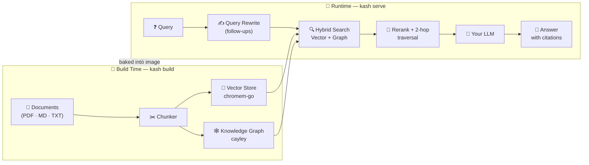

<div align="center">

# ⚡ Kash

**Cache your knowledge. Channel the Akashic.**

*Compile your documents into an embedded GraphRAG brain — ship AI agents as Docker images.*

<br/>


<br/><br/>

```text
📄 Your Documents  →  ⚡ kash build  →  🐳 Docker Image  →  🚀 Ship Anywhere
```

</div>

---

## 💡 Why Kash?

RAG usually means Python servers, external vector databases, and infrastructure glue. **Kash is a compiler instead**: it ingests your documents at *build time* and produces a single self-contained agent that just serves queries at runtime.

| | Typical RAG Stack | ⚡ Kash |
|---|---|---|
| **Runtime** | Python + dependencies | Single Go binary |
| **Vector DB** | Hosted service (Pinecone, etc.) | Embedded (`chromem-go`) |
| **Graph DB** | Neo4j server | Embedded (`cayley`) |
| **Deploy** | Multi-service setup | One ~50MB container |
| **Share an agent** | "Clone the repo, install..." | `docker run` |

Works with **any OpenAI-compatible API** — OpenAI, Ollama, LiteLLM, OneAPI. Bring your own model. 🔑

---

## ⚡ Quick Start

```bash
# 1. Install
go install github.com/akashicode/kash/cmd/kash@latest

# 2. Scaffold a new agent
kash init my-expert

# 3. Add your knowledge (PDFs, Markdown, text — OCR handles scanned PDFs)
cp ~/docs/*.pdf my-expert/data/

# 4. Compile documents → vector + graph databases
cd my-expert
kash build --dir .

# 5. Serve locally (no Docker needed!)
kash serve -d .
```

🎉 Your agent is live at **http://localhost:8000**

> [!IMPORTANT]
> `kash init` auto-generates `~/.kash/config.yaml` on first run. Edit it with your API keys (OpenAI, Voyage, etc.) **before** running `kash build`. See [Configuration](#%EF%B8%8F-configuration).

---

## 🏗️ How It Works


```mermaid
flowchart LR
    subgraph BUILD ["🔨 Build Time — kash build"]
        A["📄 Documents<br/>(PDF · MD · TXT)"] --> B["✂️ Chunker"]
        B --> C["🧮 Vector Store<br/>chromem-go"]
        B --> D["🕸️ Knowledge Graph<br/>cayley"]
    end

    subgraph RUN ["🚀 Runtime — kash serve"]
        E["❓ Query"] --> R["✍️ Query Rewrite<br/>(follow-ups)"]
        R --> F["🔍 Hybrid Search<br/>Vector + Graph"]
        C --> F
        D --> F
        F --> G["🎯 Rerank + 2-hop<br/>traversal"]
        G --> H["🤖 Your LLM"]
        H --> I["💬 Answer<br/>with citations"]
    end

    BUILD -.->|"baked into image"| RUN
```

**Build time** — documents are chunked, embedded into a vector store, and mined for graph triples via LLM. Builds are incremental and resumable.
**Runtime** — the query is rewritten to stand alone, hybrid search finds context, graph traversal follows connected facts one hop, and the whole thing is fed to your LLM with source citations.

---

## 🔁 Incremental, Versioned Builds

`kash build` tracks every document in `data/build.manifest.json` — content hash, chunk and triple counts, and how far each phase got.

```bash
kash build              # v1 — compiles everything
cp new-books/*.pdf data/
kash build              # v2 — only the new documents are processed
```

- **Unchanged documents are skipped** — no embedding calls, no LLM calls
- **Changed documents are replaced** — old vectors and triples are removed first
- **Interrupted builds resume** — the manifest is saved after every extraction batch, so a killed build picks up at the exact batch it stopped on
- **Each change bumps the corpus version**, exposed at `GET /health` as `corpus_version` so you can tell which corpus a container is serving

| Flag | Purpose |
|---|---|
| `--rebuild` | Discard the databases and manifest, rebuild from scratch |
| `--prune` | Remove data for documents deleted from `data/` |

> [!NOTE]
> Changing the embedder model or dimensions against an existing corpus is a hard error — mixed embeddings are silently broken otherwise. Use `--rebuild`.

---

## 📊 Built-in Dashboard

`kash serve` also hosts a dashboard at **`/`** — a single self-contained page embedded in the binary, so it works in an offline container with no CDN.

| Tab | What It Shows |
|---|---|
| 📚 **Books** | Every document in the corpus: chunks, triples, build status, date |
| 🕸️ **Knowledge Graph** | Interactive force-directed explorer — zoom, pan, filter by source, click a node for its facts |
| 🔍 **Retrieval Tester** | Run any query and see exactly what the pipeline retrieves: ranked chunks with sources and similarity, plus matched graph facts |

The retrieval tester is the fastest way to diagnose a bad answer — it shows you what the LLM actually received.

---

## 🔌 Three Interfaces, One Port

Every Kash agent serves all three simultaneously on port `8000`:

| Interface | Endpoint | Use It For |
|---|---|---|
| 🌐 **REST API** | `POST /v1/chat/completions` | Drop-in OpenAI API replacement with RAG context injection |
| 🧩 **MCP Server** | `GET /mcp` | Expose knowledge as tools to Cursor, Windsurf & IDEs via [MCP](https://modelcontextprotocol.io) |
| 🤝 **A2A Protocol** | `POST /rpc/agent` | JSON-RPC for multi-agent frameworks (AutoGen, CrewAI) — *WIP* |

> 🔒 Secure all endpoints by setting the `AGENT_API_KEY` environment variable.

---

## 🚀 Ship It

<details open>
<summary><strong>🐳 Docker Compose (recommended)</strong></summary>

```bash
# Fill in .env with your runtime API keys, then:
kash build
docker compose up --build
```
</details>

<details>
<summary><strong>🐳 Docker Run</strong></summary>

```bash
docker build -t my-agent:latest .
docker run -p 8000:8000 --env-file .env my-agent:latest
```
</details>

<details>
<summary><strong>💻 Local (no Docker)</strong></summary>

```bash
kash build && kash serve
# Falls back to ~/.kash/config.yaml if env vars aren't set
```
</details>

---

## ⚙️ Configuration

### 🔨 Build Time — `~/.kash/config.yaml`

Auto-generated by `kash init`. Used by `kash build` for embedding & triple extraction:

```yaml
build_providers:
  llm:
    base_url: "https://api.openai.com/v1"
    api_key: "sk-..."
    model: "gpt-4o"
  embedder:
    base_url: "https://api.voyageai.com/v1"
    api_key: "pa-..."
    model: "voyage-3"
```

### 🚀 Runtime — Environment Variables

| Variable | Required | Purpose |
|---|:---:|---|
| `LLM_BASE_URL` / `LLM_API_KEY` / `LLM_MODEL` | ✅ | The model that answers queries |
| `EMBED_BASE_URL` / `EMBED_API_KEY` / `EMBED_MODEL` | ✅ | Embeds queries for vector search |
| `RERANK_BASE_URL` / `RERANK_API_KEY` / `RERANK_MODEL` | ➖ | Optional reranker (Cohere-compatible `/rerank`) |
| `AGENT_API_KEY` | ➖ | Optional auth for all endpoints |

> [!NOTE]
> Running locally, `kash serve` falls back to `~/.kash/config.yaml` when env vars are missing. In Docker, pass them explicitly (e.g., via `.env`).

### 🤖 Agent — `agent.yaml`

Generated per project. Holds the persona, embedding dimensions and chunk sizes:

```yaml
agent:
  name: "my-agent"
  system_prompt: |
    You are a knowledgeable expert assistant...

build:
  chunk_size: 1000       # characters per chunk (800–2000 works best)
  chunk_overlap: 200     # shared between consecutive chunks

retrieval:
  top_k: 5               # chunks injected as context
  graph_facts: 10        # knowledge-graph facts injected
```

That is all you need to write. The settings that depend on **your subject
matter** are measured from your documents, not asked for.

### 🧭 Corpus profile — derived, not configured

Extraction vocabulary, entity-resolution rules and structural numbering all
depend on what a corpus actually contains, so nobody can write them before
knowing it. `kash build` measures them into `data/domain.profile.json`:

```bash
kash profile              # what was measured, and the evidence for it
kash profile --dry-run    # re-derive and print without writing
kash build --refresh-profile
```

```
• resolution.fold_diacritics = iast
    IAST marks: 3597866 in 56/60 docs; Latin marks: 1439 in 37/60 docs
• chunker.ref_patterns = 6 detected + 2 generic
    "dhāraṇā" (105 hits, sequence 0.97); "śloka" (3209 hits, sequence 0.67)
• chunker.title_stopwords = 31 words
    4 token(s) appear in 9+ of 60 titles and cannot distinguish works
```

Configuration is layered, and **`agent.yaml` always wins**:

```
built-in defaults  <  data/domain.profile.json  <  agent.yaml
```

So you add a block to `agent.yaml` only when you disagree with what was
measured. Setting a list there *replaces* the derived one rather than merging.

```yaml
# Only if the measurement got it wrong for your corpus.
extraction:
  predicates: ["manufactured by", "launched on", "powered by"]
resolution:
  fold_diacritics: latin     # none | latin | iast | both
```

> [!IMPORTANT]
> `extraction.predicates` is a **closed vocabulary** — it is what stops the
> model inventing a new phrasing for every fact, and facts matching no
> predicate are dropped. The profile derives it from your corpus and unions it
> with the generic set, so nothing is lost. If you override it by hand, make
> sure the list covers the relations your documents actually contain.

---

## 🧬 Entity Resolution

Graph chains break when the same entity appears under different spellings — `Kármán` / `Karman`, `Dr. Feynman` / `Feynman`. `kash resolve-entities` merges them:

```bash
kash resolve-entities --dry-run   # inspect the proposed merges
kash resolve-entities             # write data/entity_aliases.json
kash resolve-entities --llm       # let the model decide the ambiguous ones
```

Merges are applied **at query time**, never by rewriting the graph — so a bad merge is a one-line JSON edit, not a re-extraction.

- **Safe merges auto-approve** — case, whitespace, honorific titles
- **Ambiguous merges are held for review** — where diacritics may distinguish real words
- **`--llm` settles the remainder**, using each entity's relations as evidence; verdicts are cached, so re-runs cost nothing
- **Your edits always win** — writing anything in a cluster's `note` marks it as yours permanently

> [!TIP]
> Entity resolution is entirely optional. Delete `data/entity_aliases.json` and the agent runs normally with no merging.

---

## 🖥️ CLI Reference

| Command | What It Does |
|---|---|
| `kash init <name>` | Scaffold a new agent project (`data/`, `agent.yaml`, `Dockerfile`) |
| `kash build` | Compile documents into vector + graph databases (incremental) |
| `kash profile` | Show the domain settings derived from your corpus, and why |
| `kash resolve-entities` | Merge entity spelling variants so graph chains connect |
| `kash serve` | Start the runtime HTTP server + dashboard |
| `kash version` | Print the Kash version |

---

## 📈 What Changed Recently

Release history lives in [CHANGELOG.md](CHANGELOG.md). The highlights below cover
a round of work focused on retrieval quality, measured against a real
42,000-triple corpus rather than assumed.

<details>
<summary><strong>🔍 Retrieval</strong> — the graph could not reach most of the corpus</summary>

<br/>

- **Graph search stopped scanning after 30 matches**, in storage order. Any common term filled that budget from whichever document was indexed first, making later documents structurally unreachable. Now scans fully and ranks whole-word matches above incidental substring hits.
- **Vector search used a fixed top-5**, and the reranker only reordered those same 5. Now pulls a 20–40 candidate pool, narrows it by rerank, and caps how many chunks any one document may contribute.
- **Homonyms were unresolvable.** A query about *saṃskāra* in its alchemical sense matched facts about the karmic sense equally well, because graph matching is lexical. Graph results are now re-ranked using the documents semantic retrieval actually selected — the embedding layer disambiguates the graph layer.
- **Follow-ups retrieved nothing.** "Tell me more about that" was sent verbatim to the vector store. Now rewritten into a standalone query using conversation history.
- **Answers didn't cite sources.** Sources were attached to every chunk and fact but the model was never told to use them.
- **2-hop traversal** surfaces connected chains (`X taught Y`, `Y founded Z`) that a flat term match cannot reach. Additive — never displaces a direct match.

</details>

<details>
<summary><strong>✂️ Chunking</strong> — chunks could be 100× too large</summary>

<br/>

- **Auto-tuning targeted 90% of the embedder's token limit.** For a 32K-token model that meant ~115,000-character chunks, which blend many topics into one embedding and destroy precision. Now capped, and configurable via `build.chunk_size`.
- **Sentence chunks had no overlap**, so context spanning a boundary was lost from both sides.
- **Byte/rune mismatch** made chunks ~3× smaller than intended for non-Latin scripts.

</details>

<details>
<summary><strong>🕸️ Knowledge graph</strong> — facts were duplicated, unattributed, and shallow</summary>

<br/>

- **Triples carried no provenance.** Every fact now records its source document and cites it in context.
- **10,611 distinct predicates for 41,987 facts** — roughly one new phrasing invented every four facts. Extraction now uses a closed vocabulary, and synonyms are canonicalized (`has` / `contains` / `includes` → one form).
- **Provenance conflation**: batching concatenated 10 raw chunks, so a title-page translator credit could bind to a text merely mentioned nearby. Passages are now explicitly delimited and the prompt forbids crossing them.
- **Entity resolution** merges spelling variants so chains stop breaking at transliteration boundaries.

</details>

<details>
<summary><strong>💾 Build & data integrity</strong></summary>

<br/>

- **Reopening a persisted vector store reported 0 documents.** `chromem`'s `CreateCollection` never errors on an existing collection — it silently replaces it with an empty one, discarding everything just loaded from disk. This also left deletes unable to see stale chunks. Fixed to get-or-create.
- **Incremental, resumable, versioned builds** replaced all-or-nothing rebuilds.
- **Embedding and extraction now run concurrently** per document — each takes `max(embed, extract)` instead of their sum.

</details>

<details>
<summary><strong>🌍 Portability</strong> — it was quietly a Sanskrit tool</summary>

<br/>

Several rules were hardcoded for an Indology corpus. The predicate vocabulary was scholarly-text specific *and* instructs the model to drop unmatched facts — so an aerospace corpus would have silently lost `manufactured by`, `launched on`, `powered by`. Diacritic folding was IAST-only (blind to `Kármán`), and a Sanskrit stem-vowel rule was always on and auto-approving. All of it now lives in `agent.yaml` with domain-neutral defaults.

</details>

---

## 🔨 Building from Source

```bash
git clone https://github.com/akashicode/kash.git
cd kash
make build          # or: make build-all for every platform
go test ./...       # full suite
```

---

<div align="center">

## 📜 License

MIT — do whatever, just keep the notice.

<br/>

**If Kash saves you an infra headache, [⭐ star the repo](https://github.com/akashicode/kash) — it helps others find it.**

</div>
