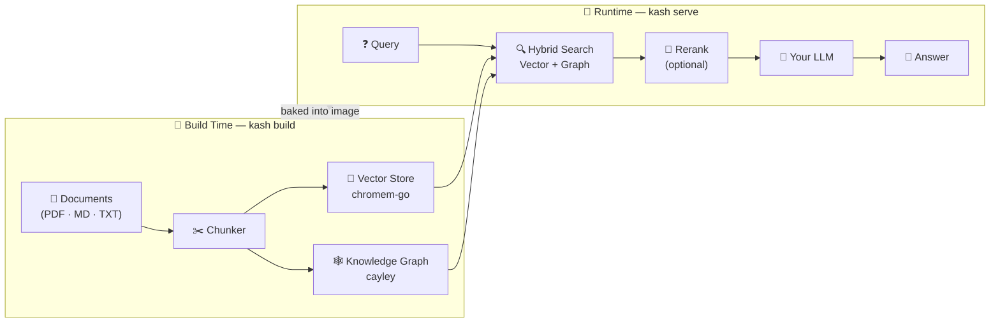

<div align="center">

# ⚡ Kash

**Cache your knowledge. Channel the Akashic.**

*Compile your documents into an embedded GraphRAG brain — ship AI agents as Docker images.*

<br/>


<br/><br/>

```text
📄 Your Documents  →  ⚡ kash build  →  🐳 Docker Image  →  🚀 Ship Anywhere
```

</div>

---

## 💡 Why Kash?

RAG usually means Python servers, external vector databases, and infrastructure glue. **Kash is a compiler instead**: it ingests your documents at *build time* and produces a single self-contained agent that just serves queries at runtime.

| | Typical RAG Stack | ⚡ Kash |
|---|---|---|
| **Runtime** | Python + dependencies | Single Go binary |
| **Vector DB** | Hosted service (Pinecone, etc.) | Embedded (`chromem-go`) |
| **Graph DB** | Neo4j server | Embedded (`cayley`) |
| **Deploy** | Multi-service setup | One ~50MB container |
| **Share an agent** | "Clone the repo, install..." | `docker run` |

Works with **any OpenAI-compatible API** — OpenAI, Ollama, LiteLLM, OneAPI. Bring your own model. 🔑

---

## ⚡ Quick Start

```bash
# 1. Install
go install github.com/akashicode/kash/cmd/kash@latest

# 2. Scaffold a new agent
kash init my-expert

# 3. Add your knowledge (PDFs, Markdown, text — OCR handles scanned PDFs)
cp ~/docs/*.pdf my-expert/data/

# 4. Compile documents → vector + graph databases
cd my-expert
kash build --dir .

# 5. Serve locally (no Docker needed!)
kash serve -d .
```

🎉 Your agent is live at **http://localhost:8000**

> [!IMPORTANT]
> `kash init` auto-generates `~/.kash/config.yaml` on first run. Edit it with your API keys (OpenAI, Voyage, etc.) **before** running `kash build`. See [Configuration](#%EF%B8%8F-configuration).

---

## 🏗️ How It Works


```mermaid
flowchart LR
    subgraph BUILD ["🔨 Build Time — kash build"]
        A["📄 Documents<br/>(PDF · MD · TXT)"] --> B["✂️ Chunker"]
        B --> C["🧮 Vector Store<br/>chromem-go"]
        B --> D["🕸️ Knowledge Graph<br/>cayley"]
    end

    subgraph RUN ["🚀 Runtime — kash serve"]
        E["❓ Query"] --> F["🔍 Hybrid Search<br/>Vector + Graph"]
        C --> F
        D --> F
        F --> G["🎯 Rerank<br/>(optional)"]
        G --> H["🤖 Your LLM"]
        H --> I["💬 Answer"]
    end

    BUILD -.->|"baked into image"| RUN
```

**Build time** — documents are chunked, embedded into a vector store, and mined for graph triples via LLM.
**Runtime** — hybrid search (vector + graph) finds context, optionally reranks it, and feeds it to your LLM.

---

## 🔌 Three Interfaces, One Port

Every Kash agent serves all three simultaneously on port `8000`:

| Interface | Endpoint | Use It For |
|---|---|---|
| 🌐 **REST API** | `POST /v1/chat/completions` | Drop-in OpenAI API replacement with RAG context injection |
| 🧩 **MCP Server** | `GET /mcp` | Expose knowledge as tools to Cursor, Windsurf & IDEs via [MCP](https://modelcontextprotocol.io) |
| 🤝 **A2A Protocol** | `POST /rpc/agent` | JSON-RPC for multi-agent frameworks (AutoGen, CrewAI) — *WIP* |

> 🔒 Secure all endpoints by setting the `AGENT_API_KEY` environment variable.

---

## 🚀 Ship It

<details open>
<summary><strong>🐳 Docker Compose (recommended)</strong></summary>

```bash
# Fill in .env with your runtime API keys, then:
kash build
docker compose up --build
```
</details>

<details>
<summary><strong>🐳 Docker Run</strong></summary>

```bash
docker build -t my-agent:latest .
docker run -p 8000:8000 --env-file .env my-agent:latest
```
</details>

<details>
<summary><strong>💻 Local (no Docker)</strong></summary>

```bash
kash build && kash serve
# Falls back to ~/.kash/config.yaml if env vars aren't set
```
</details>

---

## ⚙️ Configuration

### 🔨 Build Time — `~/.kash/config.yaml`

Auto-generated by `kash init`. Used by `kash build` for embedding & triple extraction:

```yaml
build_providers:
  llm:
    base_url: "https://api.openai.com/v1"
    api_key: "sk-..."
    model: "gpt-4o"
  embedder:
    base_url: "https://api.voyageai.com/v1"
    api_key: "pa-..."
    model: "voyage-3"
```

### 🚀 Runtime — Environment Variables

| Variable | Required | Purpose |
|---|:---:|---|
| `LLM_BASE_URL` / `LLM_API_KEY` / `LLM_MODEL` | ✅ | The model that answers queries |
| `EMBED_BASE_URL` / `EMBED_API_KEY` / `EMBED_MODEL` | ✅ | Embeds queries for vector search |
| `RERANK_BASE_URL` / `RERANK_API_KEY` / `RERANK_MODEL` | ➖ | Optional reranker (Cohere-compatible `/rerank`) |
| `AGENT_API_KEY` | ➖ | Optional auth for all endpoints |

> [!NOTE]
> Running locally, `kash serve` falls back to `~/.kash/config.yaml` when env vars are missing. In Docker, pass them explicitly (e.g., via `.env`).

### 🤖 Agent — `agent.yaml`

Generated per project. Holds the persona, embedding dimensions, and MCP tool config.

---

## 🖥️ CLI Reference

| Command | What It Does |
|---|---|
| `kash init <name>` | Scaffold a new agent project (`data/`, `agent.yaml`, `Dockerfile`) |
| `kash build` | Compile documents into vector + graph databases |
| `kash serve` | Start the runtime HTTP server |
| `kash version` | Print the Kash version |

---

## 🔨 Building from Source

```bash
git clone https://github.com/akashicode/kash.git
cd kash
make build          # or: make build-all for every platform
```

---

<div align="center">

## 📜 License

MIT — do whatever, just keep the notice.

<br/>

**If Kash saves you an infra headache, [⭐ star the repo](https://github.com/akashicode/kash) — it helps others find it.**

</div>
