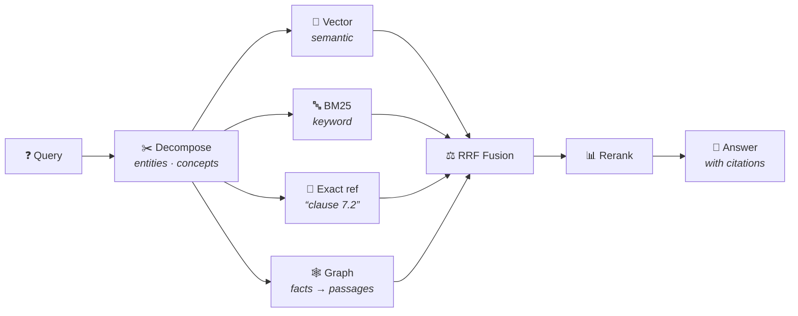

<div align="center">

# ⚡ Kash

**Cache your knowledge. Channel the Akashic.**

*A compiler for knowledge. Turn a folder of documents into a self-contained GraphRAG agent you can `docker run`.*

<br/>


<br/><br/>

```text
📄 Documents  →  ⚡ kash build  →  🐳 One Container  →  🚀 Ship Anywhere
```

</div>

---

## 💡 Why Kash?

RAG usually means a Python service, a hosted vector database, a graph server, and glue to hold them together. **Kash is a compiler instead.** All the expensive work happens once, at build time. What ships is a single binary with the databases baked in.

| | Typical RAG Stack | ⚡ Kash |
|---|---|---|
| **Runtime** | Python + dependency tree | One Go binary |
| **Vector DB** | Hosted service | Embedded (`chromem-go`) |
| **Graph DB** | Neo4j server | Embedded (`cayley`) |
| **Keyword search** | Elasticsearch cluster | Embedded (pure-Go BM25) |
| **Deploy** | Multi-service orchestration | One ~50MB container |
| **Share an agent** | *"clone the repo, install…"* | `docker run` |

Works with **any OpenAI-compatible API** — OpenAI, Voyage, Ollama, LiteLLM, OneAPI. Bring your own model. 🔑

---

## ⚡ Quick Start

```bash
# 1. Install
go install github.com/akashicode/kash/cmd/kash@latest

# 2. Scaffold an agent
kash init my-expert

# 3. Drop in your knowledge (PDF · Markdown · TXT)
cp ~/docs/*.pdf my-expert/data/

# 4. Compile
cd my-expert && kash build

# 5. Serve
kash serve
```

🎉 Live at **http://localhost:8000** — REST API, MCP server, and a dashboard.

> [!IMPORTANT]
> `kash init` writes `~/.kash/config.yaml` on first run. Put your API keys there **before** `kash build`. See [Configuration](#%EF%B8%8F-configuration).

---

## 🔍 Retrieval That Actually Finds Things

Most RAG is cosine similarity and hope. Kash runs **four independent retrieval routes** and fuses them with Reciprocal Rank Fusion — so a question phrased any way still lands.


```mermaid
flowchart LR
    Q["❓ Query"] --> D["✂️ Decompose<br/><i>entities · concepts</i>"]
    D --> V["🧮 Vector<br/><i>semantic</i>"]
    D --> L["🔤 BM25<br/><i>keyword</i>"]
    D --> X["🎯 Exact ref<br/><i>“clause 7.2”</i>"]
    D --> G["🕸️ Graph<br/><i>facts → passages</i>"]
    V --> F["⚖️ RRF Fusion"]
    L --> F
    X --> F
    G --> F
    F --> RR["📊 Rerank"]
    RR --> A["💬 Answer<br/><i>with citations</i>"]
```

| Route | Catches what the others miss |
|---|---|
| 🧮 **Vector** | Meaning. *"techniques for stilling the mind"* → passages that never use those words |
| 🔤 **BM25** | Exact terms. A rare proper noun that embeddings smooth away |
| 🎯 **Exact reference** | Structure. *"dhāraṇā 49"*, *"§ 4.2"*, *"Article 12"* — numbering detected from **your** corpus |
| 🕸️ **Graph** | Connections. Facts one hop away, resolved back to the passages that state them |

**Why fusion beats any single route:** each returns a *ranked list*, and RRF (k=60) rewards documents that several routes agree on. A chunk ranked 3rd by vectors and 2nd by BM25 outranks one ranked 1st by vectors alone.

Measured on the test corpus: **recall@5 of 1.00 fused vs 0.40 vector-only.**

<details>
<summary><strong>The knobs, if you want them</strong></summary>

<br/>

- **Candidate depth scales with the request** — `top_k × 20`, floor 200, ceiling 2000. Not a fixed pool that silently caps recall.
- **Reranking is a cascade** — the top 100 candidates go to the reranker (Cohere-compatible), the rest keep similarity order behind them. Bounded so a paid API call stays one billing unit.
- **Diversity is capped per *work*, not per file** — three editions of one book don't crowd out everything else, but a question genuinely concentrated in one text can still be answered from it.
- **Near-duplicate chunks collapse** before they reach the model.

</details>

---

## ✂️ Chunks That Know Where They Are

Kash splits on **document structure**, not every N characters. Each chunk carries a breadcrumb baked into its text at build time — so it's part of the embedding, part of the BM25 index, and part of what the model reads:

```
[Vigyāna Bhairava Tantra > Dhāraṇā 49]

Focus on the space between two breaths…
```

That single line is why *"what is dharana 49"* works: the exact-reference route can route to it, BM25 can match it, and the answer can cite it.

- 🔢 **Numbered items stay individually addressable** — a new verse or clause number starts a new chunk
- 📊 **Table headers carry** into every chunk of a long table
- 🧾 **Corrupt PDF text is rejected**, not embedded — some PDFs decode to valid UTF-8 that is actually a substitution cipher, and a quality gate catches it before it reaches the index

> [!NOTE]
> PDFs are read through their embedded text layer. Kash does not OCR — run a
> scanned PDF through OCR first, or feed it as Markdown.

---

## 🕸️ A Graph You Can Prove

Every fact records **the chunk it came from**, not just the document. That makes the whole chain walkable: `entity → chunk id → the actual passage`.

```
Knowledge Graph Facts:
- Abhinavagupta commented on Tantrāloka (source: tantraloka.md [passage 1])
  ↳ Tantrāloka is part of Trika (source: malini.md) [connected via Tantrāloka]
```

A fact whose passage was retrieved cites `[passage N]` — pointing at text the reader can see. One whose passage wasn't cites its document and nothing more. **Provenance is never invented.**

And you can audit it:

```bash
kash verify
```

```
Facts: 2202          Fold mode: iast

Traceable to a passage:
  both endpoints found      1854   84.2%
  one endpoint found         276   12.5%

Not traceable:
  passage found neither       72    3.3%
  chunk no longer exists       0    0.0%
  no chunk recorded            0    0.0%

✓ 96.7% of facts can be shown to a reader in the passage they came from
```

<details>
<summary><strong>How the graph gets built well</strong></summary>

<br/>

- **Gleaning** — after the first extraction pass the model is shown its own output and asked what it missed. Dense passages give up more than one pass gets out of them. Stops as soon as a round finds nothing new, so cost tracks recovery.
- **Closed predicate vocabulary** — derived from your corpus and unioned with a generic set. Without it, extraction invents a new phrasing every few facts and nothing ever matches.
- **Passage isolation** — batched excerpts are explicitly delimited and the prompt forbids crossing them, so a title-page translator credit can't bind to a text merely mentioned nearby.
- **Evidential weight** — a triple attested across many chunks outranks one seen once. A corpus-time quality signal, not just query-time relevance.
- **Entity resolution** — `Kármán` / `Karman`, `Dr. Feynman` / `Feynman` merge so chains stop breaking at spelling boundaries.

</details>

---

## 🧭 Zero Domain Configuration

The settings that depend on **your subject matter** are measured from your documents, not asked for. `kash build` profiles the corpus and writes `data/domain.profile.json`.

```bash
kash profile          # what was measured, and the evidence for it
```

```
• resolution.fold_diacritics = iast
    IAST marks: 3597866 in 56/60 docs; Latin marks: 1439 in 37/60 docs
• resolution.strip_final_vowel = true
    1566 stem-vowel variant pairs, e.g. lakṣya/lakṣyam, tāmasa/tāmasam
• chunker.ref_patterns = 6 detected + 2 generic
    "dhāraṇā" (105 hits, sequence 0.97); "śloka" (3209 hits, sequence 0.67)
```

Point Kash at legal contracts and it finds `Clause 4.2`. At a research library and it finds `Figure 3`. **Nobody writes a regex.**

Configuration is layered, and **`agent.yaml` always wins**:

```
built-in defaults  <  data/domain.profile.json  <  agent.yaml
```

So you only add a block when you disagree with the measurement. Setting a list there *replaces* the derived one rather than merging.

> [!NOTE]
> The model never emits a regex, a number, or a boolean during profiling — it picks from lists it was given and returns words. Your documents are untrusted input to a prompt whose output becomes configuration, so everything it returns is re-validated against what it was offered.

---

## 🔁 Incremental, Resumable Builds

`kash build` tracks every document in `data/build.manifest.json` — content hash, chunk and triple counts, and how far each phase got.

```bash
kash build              # v1 — compiles everything
cp new-books/*.pdf data/
kash build              # v2 — only the new documents are processed
```

- ⏭️ **Unchanged documents are skipped** — no embedding calls, no LLM calls
- ♻️ **Changed documents are replaced** — old vectors and triples removed first
- 🔌 **Interrupted builds resume** at the exact batch they stopped on
- 🏷️ **Each change bumps the corpus version**, exposed at `GET /health`

| Flag | Purpose |
|---|---|
| `--rebuild` | Discard the databases and manifest, start from scratch |
| `--prune` | Remove data for documents deleted from `data/` |
| `--refresh-profile` | Re-derive the corpus profile |

> [!NOTE]
> Changing the embedder or its dimensions against an existing corpus is a hard error — mixed embeddings fail silently otherwise. Same for structural rules, which are baked into chunk metadata. Use `--rebuild`.

---

## 📊 Built-in Dashboard

`kash serve` hosts a dashboard at **`/`** — one self-contained page embedded in the binary, so it works offline in a container with no CDN.

| Tab | What It Shows |
|---|---|
| 📚 **Books** | Every document: chunks, triples, build status, date |
| 🕸️ **Knowledge Graph** | Force-directed explorer — zoom, filter by source, click a node for its facts |
| 🔍 **Retrieval Tester** | Run a query, see exactly what the pipeline retrieved and which routes fired |

The retrieval tester is the fastest way to diagnose a bad answer — it shows you what the model actually received.

---

## 🔌 Three Interfaces, One Port

| Interface | Endpoint | Use It For |
|---|---|---|
| 🌐 **REST API** | `POST /v1/chat/completions` | Drop-in OpenAI replacement with RAG context injected |
| 🧩 **MCP Server** | `GET /mcp` | Expose your knowledge as tools to Claude, Cursor, Windsurf via [MCP](https://modelcontextprotocol.io) |
| 🤝 **A2A Protocol** | `POST /rpc/agent` | JSON-RPC for multi-agent frameworks — *WIP* |

> 🔒 Secure every endpoint with the `AGENT_API_KEY` environment variable.

---

## 🚀 Ship It

<details open>
<summary><strong>🐳 Docker Compose (recommended)</strong></summary>

```bash
# Fill in .env with your runtime API keys, then:
kash build
docker compose up --build
```
</details>

<details>
<summary><strong>🐳 Docker Run</strong></summary>

```bash
docker build -t my-agent:latest .
docker run -p 8000:8000 --env-file .env my-agent:latest
```
</details>

<details>
<summary><strong>💻 Local (no Docker)</strong></summary>

```bash
kash build && kash serve
# Falls back to ~/.kash/config.yaml when env vars aren't set
```
</details>

---

## ⚙️ Configuration

### 🔨 Build Time — `~/.kash/config.yaml`

Auto-generated by `kash init`. Used by `kash build` for embedding and extraction:

```yaml
build_providers:
  llm:
    base_url: "https://api.openai.com/v1"
    api_key: "sk-..."
    model: "gpt-4o"
    # reasoning_effort: medium   # low | medium | high — reasoning models only
  embedder:
    base_url: "https://api.voyageai.com/v1"
    api_key: "pa-..."
    model: "voyage-3"
```

### 🚀 Runtime — Environment Variables

| Variable | Required | Purpose |
|---|:---:|---|
| `LLM_BASE_URL` / `LLM_API_KEY` / `LLM_MODEL` | ✅ | The model that answers queries |
| `LLM_REASONING_EFFORT` | ➖ | `low` │ `medium` │ `high`; unset disables it |
| `EMBED_BASE_URL` / `EMBED_API_KEY` / `EMBED_MODEL` | ✅ | Embeds queries for vector search |
| `RERANK_BASE_URL` / `RERANK_API_KEY` / `RERANK_MODEL` | ➖ | Optional reranker (Cohere-compatible `/rerank`) |
| `AGENT_API_KEY` | ➖ | Auth for all endpoints |

### 🤖 Agent — `agent.yaml`

Generated per project. Persona, dimensions, chunk sizes — and that's genuinely all you need to write:

```yaml
agent:
  name: "my-agent"
  system_prompt: |
    You are a knowledgeable expert assistant...

runtime:
  embedder:
    dimensions: 1024     # must match at build AND serve time
  llm:
    reasoning_effort: medium   # optional

build:
  chunk_size: 1000       # characters per chunk (800–2000 works best)
  chunk_overlap: 200

retrieval:
  top_k: 5               # chunks injected as context
  graph_facts: 10        # graph facts injected
```

---

## 🖥️ CLI Reference

| Command | What It Does |
|---|---|
| `kash init <name>` | Scaffold a project (`data/`, `agent.yaml`, `Dockerfile`) |
| `kash build` | Compile documents into vector + graph + BM25 indexes |
| `kash profile` | Show the domain settings derived from your corpus, and why |
| `kash verify` | Audit how much of the graph traces back to a source passage |
| `kash resolve-entities` | Merge entity spelling variants so graph chains connect |
| `kash serve` | Start the HTTP server + dashboard |
| `kash version` | Print version, commit and build date |

---

## 🔨 Building from Source

```bash
git clone https://github.com/akashicode/kash.git
cd kash
make build          # or: make build-all for every platform
go test ./...       # full suite
```

Release history and upgrade notes live in **[CHANGELOG.md](CHANGELOG.md)** — including which changes need a `kash build --rebuild`.

---

<div align="center">

## 📜 License

MIT — do whatever, just keep the notice.

<br/>

**If Kash saves you an infra headache, [⭐ star the repo](https://github.com/akashicode/kash) — it helps others find it.**

</div>
