<p align="center">
  
  
  
  
</p>

<p align="center">
  
  
  
</p>

<h1 align="center">⚡ Kash</h1>

<p align="center">
  <strong>Cache your knowledge. Channel the Akashic.</strong><br/>
  <em>Compile your documents into an embedded GraphRAG brain. Ship AI agents as Docker images.</em>
</p>

<p align="center">
  <code>Agent as a Service</code> · <code>Knowledge as a Service</code>
</p>

> **Kash** /kæʃ/ — A double-entendre by design.
> Like a **cache**, it compiles your heavy knowledge into a fast, local binary you can ship anywhere.
> Like the **Akashic** records, it holds a complete, queryable record of everything you've fed it.
> One word. Two meanings. Zero infrastructure.

---

## 💡 What is Kash?

Kash is a **Go CLI** that turns your raw documents (PDFs, Markdown, text files) into a **self-contained AI agent** packaged in a **lightweight Docker container** (~50MB).

No Python runtime. No external vector databases. No infrastructure headaches.

```
Your Documents  →  kash build  →  Docker Image  →  Ship Anywhere 🚀
```

Think of it like a **static site generator, but for AI brains**. You compile knowledge at build time, and the runtime only serves queries — fast, lightweight, and portable.

### The "Compiler" Approach

| Traditional RAG Stack | Kash |
|---|---|
| Python app + Pinecone + Redis + FastAPI | **Single Go binary + lightweight Docker image** |
| Runtime document ingestion | **Build-time compilation** |
| External vector DB dependency | **Embedded pure-Go vector store** |
| Complex deployment | **`docker run` and done** |
| $$$ infrastructure costs | **Runs on a Raspberry Pi** |

---

## 🎯 Use Cases

<table>
<tr>
<td width="50%">

### 📖 Expert Knowledge Agent
Feed your company docs, runbooks, or research papers. Get an AI that *actually knows your stuff* and cites sources.

**Example:** Internal engineering wiki → Docker image → every dev has a domain expert on tap.

</td>
<td width="50%">

### 🎓 Study / Exam Prep Agent
Compile textbooks and notes into a Socratic tutor that quizzes you, explains concepts, and never makes things up.

**Example:** UPSC prep material → AI tutor → study from anywhere.

</td>
</tr>
<tr>
<td width="50%">

### 🛠️ Product Support Agent
Turn your API docs, changelogs, and FAQs into a support bot that plugs into any chat UI or IDE.

**Example:** Docs + release notes → Docker image → mount in Open WebUI.

</td>
<td width="50%">

### 🤝 Multi-Agent Teams
Spin up multiple specialized agents (legal, finance, engineering) and wire them together via A2A protocol.

**Example:** Three domain agents → CrewAI orchestration → one smart team.

</td>
</tr>
</table>

---

## Scanned PDFs / OCR

Note: Scanned (image-only) PDF support (OCR) is not yet available. Kash currently extracts embedded/selectable text only.

---

## ⚡ Quick Start

### 5-Minute Setup

```bash
# 1. Install Kash (build from source — see "Building from Source" below)
go install github.com/akashicode/kash/cmd/kash@latest

# 2. Configure your API providers
mkdir -p ~/.kash
cat > ~/.kash/config.yaml << 'EOF'
build_providers:
  llm:
    base_url: "https://api.openai.com/v1"
    api_key: "sk-..."
    model: "gpt-4o"
  embedder:
    base_url: "https://api.voyageai.com/v1"
    api_key: "pa-..."
    model: "voyage-3"       # make sure the model dimensions match in agent.yaml in agent config
EOF

# 3. Scaffold a new agent
kash init my-expert

# 4. Add your knowledge
cp ~/docs/*.pdf my-expert/data/
cp ~/notes/*.md my-expert/data/

# 5. Compile the knowledge base
cd my-expert
kash build --dir /path/to/my-expert

# 6. Serve locally (no Docker needed!)
kash serve -d /path/to/my-expert
```

Your agent is now live at **http://localhost:8000** with three interfaces ready to go.

---

## 🏗️ Architecture

```mermaid
flowchart TB
    subgraph BUILD["🔨 Build Time"]
        direction LR
        D["📄 Documents\nPDF / MD / TXT"] --> CK["Chunker"]
        CK --> EMB["Embedder API"]
        CK --> LLM1["LLM API\ntriple extraction"]
        EMB --> VDB["Vector DB\ndata/memory.chromem"]
        LLM1 --> GDB["Graph DB\ndata/knowledge.cayley"]
    end

    BUILD -- "docker build" --> RUNTIME

    subgraph RUNTIME["⚡ Runtime — port 8000"]
        direction LR
        Q["Query"] --> HS["Hybrid Search\nVector + Graph"]
        HS --> RR["Rerank\noptional"]
        RR --> LLM2["LLM"]
        LLM2 --> REST["REST API\nPOST /v1/chat/completions"]
        LLM2 --> MCP["MCP Server\nGET /mcp"]
        LLM2 --> A2A["A2A Protocol\nPOST /rpc/agent"]
    end
```



### Core Stack

| Component | Technology | Purpose |
|---|---|---|
| **CLI Framework** | `spf13/cobra` | Developer interface (`init`, `build`, `serve`) |
| **Vector Memory** | `philippgille/chromem-go` | Pure-Go embedded vector store |
| **Graph Memory** | `cayleygraph/cayley` | Embedded knowledge graph (triples) |
| **LLM Client** | `sashabaranov/go-openai` | Build-time extraction & runtime queries |
| **MCP Protocol** | Model Context Protocol | Tool exposure for Cursor / Windsurf / IDEs |
| **A2A Protocol** | JSON-RPC | Multi-agent orchestration (AutoGen, CrewAI) |

### Hybrid RAG Pipeline

Every query (REST, MCP, A2A) runs through the same pipeline:

```mermaid
flowchart LR
    Q["Query"] --> E["Embed"]
    Q --> K["Keywords"]
    E --> VS["Vector Search\nchromem-go"]
    K --> GT["Graph Traversal\ncayley"]
    VS --> M["Merge"]
    GT --> M
    M --> R["Rerank\noptional"]
    R --> C["Context → LLM"]
```



---

## 🖥️ CLI Reference

### `kash init <name>`

Scaffolds a new agent project.

```bash
kash init my-agent
```

Creates:
```
my-agent/
├── data/               # Drop your PDFs, Markdown, TXT here
├── agent.yaml          # Agent persona + config
├── Dockerfile          # Ready for docker build
├── docker-compose.yml  # One-command local deployment
├── .env.example        # Runtime env var template
├── .dockerignore       # Keeps images clean
└── README.md           # Auto-generated docs
```

### `kash build`

Compiles documents into vector + graph databases.

```bash
kash build                     # in current directory
kash build --dir ./my-agent    # specify project dir
```

| Flag | Short | Default | Description |
|---|---|---|---|
| `--dir` | `-d` | `.` | Project directory to build |

**Pipeline:**
1. Load documents from `data/`
2. Chunk text into passages
3. Generate vector embeddings → `data/memory.chromem/`
4. Extract knowledge graph triples → `data/knowledge.cayley/`
5. Auto-generate MCP tool descriptions → `agent.yaml`

### `kash serve`

Starts the runtime HTTP server.

```bash
kash serve                          # default: port 8000, ./agent.yaml
kash serve --port 9000              # custom port
kash serve --dir ./my-agent         # serve from specific directory
kash serve --agent custom.yaml      # custom agent config path
```

| Flag | Short | Default | Description |
|---|---|---|---|
| `--port` | `-p` | `8000` | Listen port (overridden by `PORT` env var) |
| `--agent` | `-a` | `agent.yaml` | Path to agent configuration |
| `--dir` | `-d` | `.` | Project directory |

### `kash version`

```bash
kash version
# kash v1.0.0
#   commit:     a3f9c12
#   built:      2026-02-27T10:00:00Z
#   go version: go1.25.0
#   os/arch:    linux/amd64
```

---

## 🔌 Runtime Interfaces

All three interfaces serve concurrently on a single port.

### REST API — `POST /v1/chat/completions`

Drop-in replacement for the OpenAI API. Intercepts requests, runs hybrid RAG, injects context, proxies to your LLM.

```bash
curl http://localhost:8000/v1/chat/completions \
  -H "Content-Type: application/json" \
  -d '{
    "model": "gpt-4o",
    "messages": [{"role": "user", "content": "Explain the key concepts"}]
  }'
```

> Works with **LibreChat**, **Open WebUI**, **AnythingLLM**, and any OpenAI-compatible client.

### MCP Server — `GET /mcp`

[Model Context Protocol](https://modelcontextprotocol.io) over HTTP SSE. Exposes your knowledge base as tools to IDEs.

```json
{
  "mcpServers": {
    "my-agent": {
      "url": "http://localhost:8000/mcp"
    }
  }
}
```

> Tested and working with **Cursor** and **Windsurf**.

### A2A Protocol — `POST /rpc/agent`

JSON-RPC for multi-agent frameworks.

```bash
# Agent info
curl http://localhost:8000/rpc/agent \
  -H "Content-Type: application/json" \
  -d '{"jsonrpc":"2.0","id":1,"method":"agent.info"}'

# Query knowledge
curl http://localhost:8000/rpc/agent \
  -H "Content-Type: application/json" \
  -d '{"jsonrpc":"2.0","id":2,"method":"agent.query","params":{"query":"your question"}}'
```

> 🧪 *A2A protocol implementation is complete. Integration testing with AutoGen/CrewAI is in progress.*

---

## 🔐 Security — API Key Auth

By default all endpoints are open (ideal for local dev). Set `AGENT_API_KEY` to enable authentication on all endpoints except `/health`.

```bash
export AGENT_API_KEY="my-secret-key"
kash serve
```

The key is passed as a standard Bearer token — compatible with all three interfaces:

### curl / any HTTP client
```bash
curl http://localhost:8000/v1/chat/completions \
  -H "Authorization: Bearer my-secret-key" \
  -H "Content-Type: application/json" \
  -d '{"model":"gpt-4o","messages":[{"role":"user","content":"hello"}]}'
```

### OpenAI Python / JS SDK
```python
from openai import OpenAI

client = OpenAI(
    base_url="http://localhost:8000/v1",
    api_key="my-secret-key",   # ← AGENT_API_KEY goes here
)
```

```ts
import OpenAI from 'openai';
const client = new OpenAI({
  baseURL: 'http://localhost:8000/v1',
  apiKey: 'my-secret-key',
});
```

### MCP clients (Cursor, Claude Desktop, Windsurf)
```json
{
  "mcpServers": {
    "my-agent": {
      "url": "http://localhost:8000/mcp",
      "env": {
        "API_KEY": "my-secret-key"
      }
    }
  }
}
```

### A2A clients
```bash
curl http://localhost:8000/rpc/agent \
  -H "Authorization: Bearer my-secret-key" \
  -H "Content-Type: application/json" \
  -d '{"jsonrpc":"2.0","id":1,"method":"agent.info"}'
```

When `AGENT_API_KEY` is not set, everything works without any header (open access).

---

### Health Check — `GET /health`

```bash
curl http://localhost:8000/health
```

```json
{
  "status": "ok",
  "agent": "my-expert",
  "version": "1.0.0",
  "vectors": 892,
  "triples": 1423,
  "mcp_tools": 1,
  "embed_dimensions": 1024,
  "llm_model": "gpt-4o",
  "embed_model": "voyage-3",
  "reranker_enabled": false,
  "auth_enabled": true,
  "time": "2026-02-27T10:00:00Z"
}
```

> `/health` is always public — no auth required even when `AGENT_API_KEY` is set.

---

## 🚀 Running Your Agent

### Option 1: Local (No Docker)

Perfect for development and testing. Just build and serve directly:

```bash
# Set up providers
export LLM_BASE_URL="https://api.openai.com/v1"
export LLM_API_KEY="sk-..."
export LLM_MODEL="gpt-4o"
export EMBED_BASE_URL="https://api.voyageai.com/v1"
export EMBED_API_KEY="pa-..."

# Build the knowledge base
kash build

# Serve it
kash serve
```

That's it. Hit `http://localhost:8000` and start chatting.

### Option 2: Docker Compose (Recommended)

One command to build and run:

```bash
# Fill in your keys
cp .env.example .env
# edit .env with your API keys

# Build the knowledge base first
kash build

# Build image + run
docker compose up --build
```

### Option 3: Docker Run (Manual)

```bash
# Build the image
docker build -t my-agent:latest .

# Run with env vars
docker run -p 8000:8000 \
  -e LLM_BASE_URL="https://api.openai.com/v1" \
  -e LLM_API_KEY="sk-..." \
  -e LLM_MODEL="gpt-4o" \
  -e EMBED_BASE_URL="https://api.voyageai.com/v1" \
  -e EMBED_API_KEY="pa-..." \
  -e AGENT_API_KEY="my-secret-key" \
  my-agent:latest
```

### Option 4: Share With the World 🌍

Build a multi-arch image and push to any registry:

```bash
# Build for both x86 and ARM (runs on servers + Raspberry Pi)
docker buildx build --platform linux/amd64,linux/arm64 \
  -t ghcr.io/you/my-agent:v1 --push .

# Anyone can now run your agent with one command:
docker run -p 8000:8000 --env-file .env ghcr.io/you/my-agent:v1
```

Your agent is now a portable Docker image that anyone can pull and run. They just bring their own API keys.

---

## ⚙️ Configuration

### Build-Time: `~/.kash/config.yaml`

Used by `kash build` to call LLM and embedding APIs.

```yaml
build_providers:
  llm:
    base_url: "https://api.openai.com/v1"    # or any OpenAI-compatible endpoint
    api_key: "sk-..."
    model: "gpt-4o"
  embedder:
    base_url: "https://api.voyageai.com/v1"
    api_key: "pa-..."
    model: "voyage-3"                          # optional if using a router
  # reranker:        # optional — must be Cohere-compatible (/rerank endpoint)
  #   base_url: "https://api.cohere.ai/v1"  # Cohere, Jina, Voyage, or a LiteLLM proxy
  #   api_key: "..."
  #   model: "rerank-english-v3.0"           # or jina-reranker-v2-base-en, rerank-1, etc.
```

> **Provider agnostic** — works with any OpenAI-compatible endpoint. Use [LiteLLM](https://github.com/BerriAI/litellm), [Ollama](https://ollama.com), or [TrueFoundry](https://truefoundry.com) as a proxy.

### Runtime: Environment Variables

Used by `kash serve` and Docker containers.

| Variable | Required | Description |
|---|---|---|
| `LLM_BASE_URL` | ✅ | OpenAI-compatible LLM endpoint |
| `LLM_API_KEY` | ✅ | LLM API key |
| `LLM_MODEL` | ✅ | Model name (e.g. `gpt-4o`) |
| `EMBED_BASE_URL` | ✅ | Embedding API endpoint |
| `EMBED_API_KEY` | ✅ | Embedding API key |
| `EMBED_MODEL` | ❌ | Embedding model (optional if using a router) |
| `RERANK_BASE_URL` | ❌ | Reranker base URL — must expose a Cohere-compatible `/rerank` endpoint |
| `RERANK_API_KEY` | ❌ | Reranker API key |
| `RERANK_MODEL` | ❌ | Reranker model name (e.g. `rerank-english-v3.0`) |
| `RERANK_ENDPOINT` | ❌ | Full rerank URL override (e.g. `https://gateway.example.com/v1/rerank`) — takes priority over `RERANK_BASE_URL` |
| `AGENT_API_KEY` | ❌ | Enable auth — all endpoints (except `/health`) require `Authorization: Bearer <key>` |
| `PORT` | ❌ | Override listen port (default: `8000`) |

### Agent Config: `agent.yaml`

Each project has an `agent.yaml` that defines persona, embedding dimensions, and MCP tools:

```yaml
agent:
  name: "my-expert"
  version: "1.0.0"
  description: "An expert AI agent powered by Kash"
  system_prompt: |
    You are a highly knowledgeable expert assistant...

runtime:
  embedder:
    dimensions: 1024    # must match build AND serve time

mcp:
  tools:
    - name: "search_my_expert_knowledge"
      description: "Auto-generated by kash build"

server:
  port: 8000
  cors_origins: ["*"]
```

> **Important:** The `dimensions` value is NOT sent to the embedding API — some providers don't support it. Kash handles truncation locally.

---

## 🔨 Building from Source

### Prerequisites

- **Go 1.25+** — [Install Go](https://go.dev/dl/)
- **Git**

### Build

```bash
git clone https://github.com/akashicode/kash.git
cd Kash

# Build for your platform
go build -o bin/kash ./cmd/Kash

# Or use Make
make build
```

### Cross-Compile

```bash
# Linux
GOOS=linux GOARCH=amd64 go build -o bin/kash-linux ./cmd/Kash

# macOS (Apple Silicon)
GOOS=darwin GOARCH=arm64 go build -o bin/kash-darwin ./cmd/Kash

# Windows
GOOS=windows GOARCH=amd64 go build -o bin/kash.exe ./cmd/Kash

# All platforms at once
make build-all
```

### Install System-Wide

```bash
# Linux / macOS
sudo make install
# → installs to /usr/local/bin/kash

# Windows (PowerShell as Admin)
Copy-Item bin\kash.exe C:\Windows\System32\kash.exe
```

---

## 🧪 Development

```bash
make test         # Run all tests
make test-v       # Verbose output
make coverage     # Generate HTML coverage report
make fmt          # Format code
make vet          # Static analysis
make lint         # golangci-lint (install first)
make tidy         # go mod tidy
make clean        # Remove build artifacts
```

### Project Layout

```
Kash/
├── cmd/                          # CLI commands (Cobra)
│   ├── kash/main.go       # Entry point
│   ├── root.go                   # Root command + Viper config
│   ├── init.go                   # kash init
│   ├── build.go                  # kash build
│   ├── serve.go                  # kash serve
│   └── version.go                # kash version
├── internal/
│   ├── config/                   # Unified config (env + YAML)
│   ├── display/                  # Colorful CLI output + banners
│   ├── chunker/                  # Text chunking
│   ├── reader/                   # Document loading (PDF, MD, TXT)
│   ├── llm/                      # LLM client, embedder, reranker
│   ├── vector/                   # chromem-go vector store
│   ├── graph/                    # cayley knowledge graph
│   └── server/                   # HTTP server (REST, MCP, A2A)
├── Makefile
├── Dockerfile                    # Base image (multi-arch)
└── go.mod
```

---

## 📊 Project Status

| Feature | Status | Notes |
|---|---|---|
| `kash init` | ✅ Stable | Full project scaffolding |
| `kash build` | ✅ Stable | PDF, Markdown, TXT ingestion |
| `kash serve` | ✅ Stable | All three interfaces |
| REST API | ✅ Tested | Drop-in OpenAI replacement |
| MCP Server | ✅ Tested | Works with Cursor & Windsurf |
| A2A Protocol | 🧪 In Progress | Implementation done, testing pending |
| Hybrid RAG | ✅ Stable | Vector + Graph search |
| Reranker | ✅ Optional | Cohere-compatible rerank API (`/rerank` endpoint) |
| Multi-arch Docker | ✅ Stable | amd64 + arm64 |
| Streaming responses | ✅ Stable | SSE streaming for REST API |

---

## 🌟 Why Kash?

<table>
<tr>
<td>🧊</td>
<td><strong>Zero Infrastructure</strong> — No Pinecone, no Redis, no PostgreSQL. Everything is embedded in a single binary.</td>
</tr>
<tr>
<td>🐳</td>
<td><strong>Ship as Docker</strong> — Your agent is a lightweight image. Push to a registry and anyone can run it with <code>docker run</code>.</td>
</tr>
<tr>
<td>🔑</td>
<td><strong>BYOM (Bring Your Own Model)</strong> — Works with OpenAI, Anthropic (via proxy), Ollama, LiteLLM, TrueFoundry — any OpenAI-compatible endpoint.</td>
</tr>
<tr>
<td>⚡</td>
<td><strong>Fast</strong> — Go binary starts in <50ms. No Python cold starts. No dependency hell.</td>
</tr>
<tr>
<td>🧠</td>
<td><strong>Hybrid RAG</strong> — Vector similarity + knowledge graph traversal. Better context than vector-only retrieval.</td>
</tr>
<tr>
<td>🔌</td>
<td><strong>Three Interfaces</strong> — REST (any chat UI), MCP (IDEs), A2A (multi-agent). One build, three ways to connect.</td>
</tr>
</table>

---

## 📜 License

MIT — do whatever you want with it.

---

<p align="center">
  <strong>⚡ Kash</strong><br/>
  <em>Cache your knowledge. Channel the Akashic. No infrastructure required.</em>
</p>
